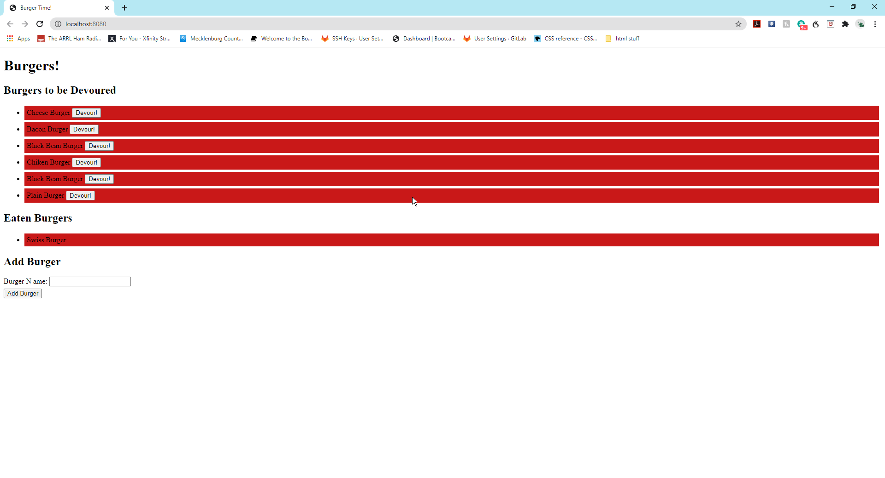

# Burger

  

## Description
 This app will help you pick a burger and eat it.
 [Demo Burger app here](https://floating-hamlet-41181.herokuapp.com)
 
 ## Table of Contents

 * [Installation](#installation)
 * [Usage](#usage)
 * [License](#license)
 * [Contributing](contributing)
 * [Tests](tests)
 * [Questions](questions)

 ## Installation
 npm i
 ## Usage
 for class us only
 ## License
 mit
 ## Contributing
 please
 ## Tests
 npm test
 ## Questions
 Direct all questions to ccollins36@icloud.com

 
